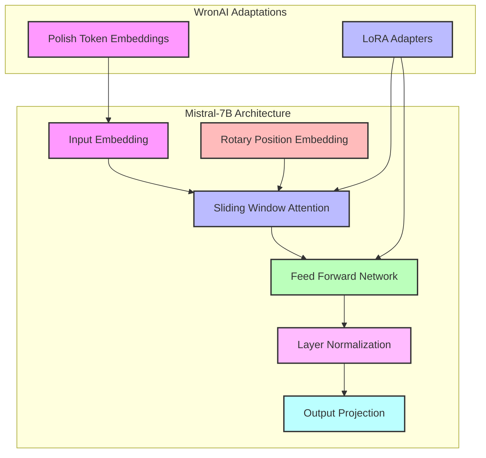
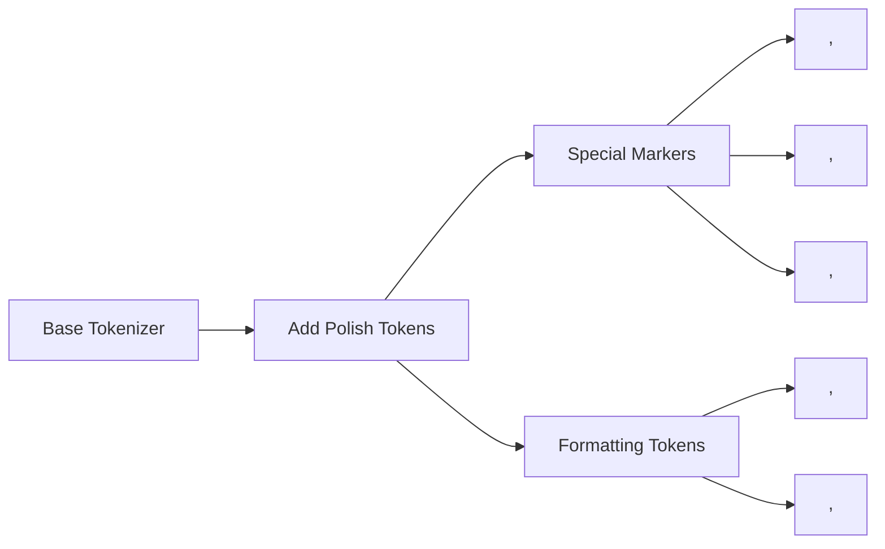
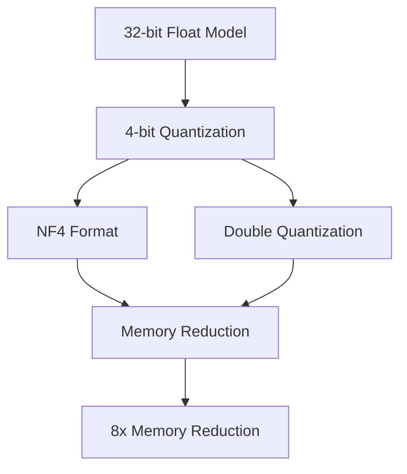

# WronAI Model Architecture

This document provides a technical overview of the WronAI model architecture, focusing on the base model structure, Polish language adaptations, and optimization techniques.

## Base Model Architecture

WronAI is built on the Mistral-7B foundation model, which uses a transformer-based architecture with several key optimizations.



### Key Components

#### Sliding Window Attention

Mistral-7B uses Sliding Window Attention (SWA) to efficiently process long sequences:

```
+---------------------------------------+
| Sliding Window Attention              |
+---------------------------------------+
|                                       |
|  +-------------------------------+    |
|  | Local Context Window          |    |
|  | (e.g., 4096 tokens)           |    |
|  +-------------------------------+    |
|                                       |
|  +-------------------------------+    |
|  | Sliding Mechanism             |    |
|  | - Shifts attention window     |    |
|  | - Maintains context coherence |    |
|  +-------------------------------+    |
|                                       |
|  +-------------------------------+    |
|  | Multi-Head Attention          |    |
|  | - 32 attention heads          |    |
|  | - Key, Query, Value projections|   |
|  +-------------------------------+    |
|                                       |
+---------------------------------------+
```

#### Rotary Position Embeddings

WronAI uses Rotary Position Embeddings (RoPE) for better handling of positional information:

```
+---------------------------------------+
| Rotary Position Embeddings            |
+---------------------------------------+
|                                       |
|  +-------------------------------+    |
|  | Rotation Matrices             |    |
|  | - Encodes relative positions  |    |
|  | - Preserves sequence order    |    |
|  +-------------------------------+    |
|                                       |
|  +-------------------------------+    |
|  | Applied to Key-Query Pairs    |    |
|  | - Enhances attention mechanism|    |
|  | - Improves long-range context |    |
|  +-------------------------------+    |
|                                       |
+---------------------------------------+
```

## Polish Language Adaptations

WronAI incorporates several adaptations specifically for Polish language processing:

### Polish-Specific Tokens



These tokens help the model understand Polish language contexts and formatting requirements.

### Instruction Format

WronAI uses a specific format for instruction-response pairs:

```
<polish><question>{instruction}</question><answer>{response}</answer></polish>
```

This structured format helps the model distinguish between instructions and responses, and maintains awareness of the Polish language context.

## LoRA Adaptation

WronAI uses Low-Rank Adaptation (LoRA) to efficiently fine-tune the base model:

```
+---------------------------------------+
| LoRA Adaptation                       |
+---------------------------------------+
|                                       |
|  Original Weight Matrix W (d×k)       |
|  +-------------------------------+    |
|  |                               |    |
|  |                               |    |
|  |                               |    |
|  +-------------------------------+    |
|                |                      |
|                | No direct updates    |
|                v                      |
|  +-------------------------------+    |
|  | LoRA Update: BA (rank r)      |    |
|  | B (d×r) and A (r×k) matrices  |    |
|  | where r << min(d,k)           |    |
|  +-------------------------------+    |
|                |                      |
|                | Scaled by α/r        |
|                v                      |
|  +-------------------------------+    |
|  | W + BA (Effective weights)    |    |
|  +-------------------------------+    |
|                                       |
+---------------------------------------+
```

### Target Modules

LoRA is applied to the following modules in the Mistral architecture:

- Query projection (`q_proj`)
- Key projection (`k_proj`)
- Value projection (`v_proj`)
- Output projection (`o_proj`)
- MLP gate projection (`gate_proj`)
- MLP up projection (`up_proj`)
- MLP down projection (`down_proj`)

### LoRA Configuration

WronAI uses the following LoRA parameters:

| Parameter | Value | Description |
|-----------|-------|-------------|
| r | 16 | Rank of LoRA update matrices |
| lora_alpha | 32 | LoRA scaling factor |
| lora_dropout | 0.1 | Dropout probability for LoRA layers |
| bias | "none" | Bias configuration |
| task_type | "CAUSAL_LM" | Task type for LoRA |

## Quantization

WronAI uses 4-bit quantization to reduce memory usage:



### Quantization Parameters

| Parameter | Value | Description |
|-----------|-------|-------------|
| load_in_4bit | true | Enable 4-bit quantization |
| bnb_4bit_compute_dtype | "bfloat16" | Compute dtype for 4-bit quantization |
| bnb_4bit_quant_type | "nf4" | Quantization type (NF4) |
| bnb_4bit_use_double_quant | true | Enable double quantization |

## Memory Optimization

WronAI incorporates several techniques to optimize memory usage:

```
+---------------------------------------+
| Memory Optimization Techniques        |
+---------------------------------------+
|                                       |
|  +-------------------------------+    |
|  | 4-bit Quantization            |    |
|  | - 8x memory reduction         |    |
|  | - NF4 format for better quality|   |
|  +-------------------------------+    |
|                                       |
|  +-------------------------------+    |
|  | Gradient Checkpointing        |    |
|  | - Recomputes activations      |    |
|  | - Trades computation for memory|   |
|  +-------------------------------+    |
|                                       |
|  +-------------------------------+    |
|  | Small Batch Size              |    |
|  | - Batch size of 1             |    |
|  | - 16 gradient accumulation    |    |
|  +-------------------------------+    |
|                                       |
|  +-------------------------------+    |
|  | CPU Offloading                |    |
|  | - Moves parameters to CPU     |    |
|  | - Loads to GPU when needed    |    |
|  +-------------------------------+    |
|                                       |
+---------------------------------------+
```

These optimizations allow WronAI to run on consumer hardware with as little as 8GB of VRAM.

## Model Capabilities

WronAI is designed to excel at Polish language tasks:

### Polish Language Understanding

- Comprehension of Polish grammar and syntax
- Understanding of Polish idioms and cultural references
- Processing of Polish-specific characters and diacritics

### Instruction Following

- Following instructions provided in Polish
- Generating appropriate responses to questions
- Maintaining conversation context

### Text Generation

- Coherent and fluent Polish text generation
- Formal and informal language styles
- Domain-specific knowledge application

## Code References

- Base model configuration: [`configs/default.yaml`](../configs/default.yaml#L4-L8)
- LoRA configuration: [`configs/default.yaml`](../configs/default.yaml#L11-L23)
- Quantization configuration: [`configs/default.yaml`](../configs/default.yaml#L26-L30)
- Polish token addition: [`scripts/train.py`](../scripts/train.py#L61-L71)
- Model loading with quantization: [`scripts/train.py`](../scripts/train.py#L79-L108)
- LoRA application: [`scripts/train.py`](../scripts/train.py#L112-L121)

## Related Documentation

- [Training Guide](training.md): Guide to training the WronAI model
- [Pipeline Documentation](pipeline.md): Technical overview of the training pipeline
- [Inference Guide](inference.md): How to use the trained model
- [Benchmarks](benchmarks.md): Performance evaluation

## References

- [Mistral-7B Paper](https://arxiv.org/abs/2310.06825): Original Mistral-7B paper
- [QLoRA Paper](https://arxiv.org/abs/2305.14314): Quantized Low-Rank Adaptation
- [PEFT Documentation](https://huggingface.co/docs/peft/index): Parameter-Efficient Fine-Tuning
- [BitsAndBytes Documentation](https://github.com/TimDettmers/bitsandbytes): Quantization library
