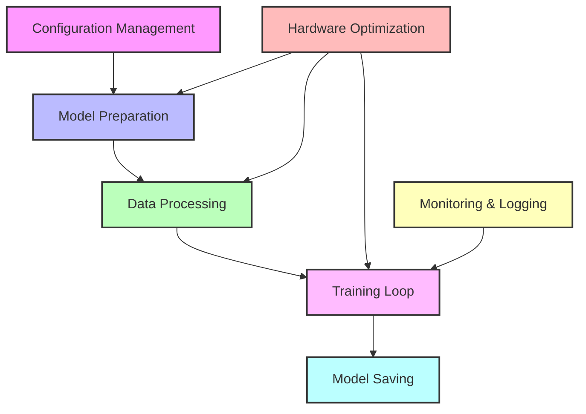
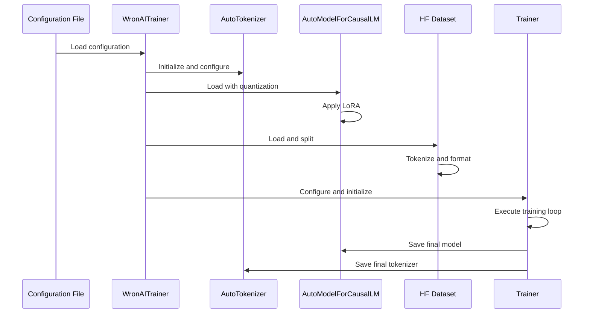

# WronAI LLM Training Pipeline

This document provides a technical overview of the WronAI LLM training pipeline, with links to specific code files and components. It serves as a reference for developers who want to understand or modify the training process.

## Pipeline Architecture

The WronAI training pipeline consists of several interconnected components that handle different aspects of the LLM training process.

### High-Level Architecture



### Detailed Component Diagram

```
+------------------------------------------+
| WronAI Training Pipeline                 |
+------------------------------------------+
|                                          |
|  +----------------------------------+    |
|  | Configuration Management         |    |
|  | - configs/default.yaml           |    |
|  | - WronAITrainer.load_config()    |    |
|  +----------------------------------+    |
|                 |                        |
|                 v                        |
|  +----------------------------------+    |
|  | Model Preparation                |    |
|  | - WronAITrainer.load_tokenizer() |    |
|  | - WronAITrainer.load_model()     |    |
|  +----------------------------------+    |
|                 |                        |
|                 v                        |
|  +----------------------------------+    |
|  | Data Processing                  |    |
|  | - WronAITrainer.load_dataset()   |    |
|  | - tokenize_function()            |    |
|  +----------------------------------+    |
|                 |                        |
|                 v                        |
|  +----------------------------------+    |
|  | Training Loop                    |    |
|  | - TrainingArguments configuration|    |
|  | - Trainer initialization         |    |
|  | - trainer.train()                |    |
|  +----------------------------------+    |
|                 |                        |
|                 v                        |
|  +----------------------------------+    |
|  | Model Saving                     |    |
|  | - trainer.save_model()           |    |
|  | - tokenizer.save_pretrained()    |    |
|  +----------------------------------+    |
|                                          |
+------------------------------------------+
```

## Code Structure

### Entry Point

- [`scripts/train.py`](../scripts/train.py): Main training script that orchestrates the entire pipeline

### Core Components

1. **Configuration Management**
   - [`configs/default.yaml`](../configs/default.yaml): Default training configuration
   - [`WronAITrainer.load_config()`](../scripts/train.py#L39): Configuration loading method

2. **Model Preparation**
   - [`WronAITrainer.load_tokenizer()`](../scripts/train.py#L49): Tokenizer loading and configuration
   - [`WronAITrainer.load_model()`](../scripts/train.py#L79): Model loading with quantization and LoRA

3. **Data Processing**
   - [`WronAITrainer.load_dataset()`](../scripts/train.py#L129): Dataset loading and splitting
   - [`tokenize_function()`](../scripts/train.py#L149): Data tokenization and formatting

4. **Training Loop**
   - [`TrainingArguments`](../scripts/train.py#L179): Training arguments configuration
   - [`Trainer`](../scripts/train.py#L217): Trainer initialization
   - [`trainer.train()`](../scripts/train.py#L227): Training execution

5. **Model Saving**
   - [`trainer.save_model()`](../scripts/train.py#L231): Model saving
   - [`tokenizer.save_pretrained()`](../scripts/train.py#L232): Tokenizer saving

### Supporting Components

1. **Hardware Optimization**
   - [`BitsAndBytesConfig`](../scripts/train.py#L84): Quantization configuration
   - [`prepare_model_for_kbit_training()`](../scripts/train.py#L109): k-bit training preparation
   - [`gradient_checkpointing`](../scripts/train.py#L204): Gradient checkpointing configuration

2. **Monitoring & Logging**
   - [`setup_logging()`](../scripts/train.py#L44): Logging setup
   - [`wandb.init()`](../scripts/train.py#L45): Weights & Biases initialization

## Data Flow

The data flow through the pipeline can be visualized as follows:



## Configuration Parameters

The training pipeline is highly configurable through the YAML configuration file. Here are the key parameter groups:

### Model Parameters

| Parameter | Description | File Reference |
|-----------|-------------|---------------|
| `model.name` | Base model to fine-tune | [`configs/default.yaml`](../configs/default.yaml#L5) |
| `model.trust_remote_code` | Allow execution of remote code | [`configs/default.yaml`](../configs/default.yaml#L6) |
| `model.torch_dtype` | Precision for computation | [`configs/default.yaml`](../configs/default.yaml#L7) |
| `model.device_map` | Device allocation strategy | [`configs/default.yaml`](../configs/default.yaml#L8) |

### LoRA Parameters

| Parameter | Description | File Reference |
|-----------|-------------|---------------|
| `lora.r` | Rank of LoRA update matrices | [`configs/default.yaml`](../configs/default.yaml#L12) |
| `lora.lora_alpha` | LoRA scaling factor | [`configs/default.yaml`](../configs/default.yaml#L13) |
| `lora.lora_dropout` | Dropout probability | [`configs/default.yaml`](../configs/default.yaml#L14) |
| `lora.target_modules` | Modules to apply LoRA to | [`configs/default.yaml`](../configs/default.yaml#L17-L23) |

### Quantization Parameters

| Parameter | Description | File Reference |
|-----------|-------------|---------------|
| `quantization.load_in_4bit` | Enable 4-bit quantization | [`configs/default.yaml`](../configs/default.yaml#L27) |
| `quantization.bnb_4bit_quant_type` | Quantization type | [`configs/default.yaml`](../configs/default.yaml#L29) |
| `quantization.bnb_4bit_use_double_quant` | Enable double quantization | [`configs/default.yaml`](../configs/default.yaml#L30) |

### Training Parameters

| Parameter | Description | File Reference |
|-----------|-------------|---------------|
| `training.num_train_epochs` | Number of training epochs | [`configs/default.yaml`](../configs/default.yaml#L35) |
| `training.per_device_train_batch_size` | Batch size per device | [`configs/default.yaml`](../configs/default.yaml#L36) |
| `training.gradient_accumulation_steps` | Gradient accumulation steps | [`configs/default.yaml`](../configs/default.yaml#L38) |
| `training.learning_rate` | Learning rate | [`configs/default.yaml`](../configs/default.yaml#L40) |

## Integration Points

The WronAI training pipeline integrates with several external libraries and systems:

1. **Hugging Face Transformers**
   - Model loading and tokenization
   - Training infrastructure

2. **PEFT (Parameter-Efficient Fine-Tuning)**
   - LoRA configuration and application

3. **BitsAndBytes**
   - Quantization for memory-efficient training

4. **Weights & Biases**
   - Training monitoring and logging

5. **Datasets**
   - Data loading and processing

## Extending the Pipeline

The WronAI training pipeline is designed to be extensible. Here are common extension points:

### Adding Custom Tokenization

Modify the [`load_tokenizer()`](../scripts/train.py#L49) method to add custom tokenization logic:

```python
def load_tokenizer(self) -> AutoTokenizer:
    # ... existing code ...
    
    # Add your custom tokenization logic here
    if self.config["custom"]["use_custom_tokenizer"]:
        # Custom tokenization code
        pass
        
    # ... rest of the method ...
```

### Custom Dataset Processing

Extend the [`tokenize_function()`](../scripts/train.py#L149) to add custom data processing:

```python
def tokenize_function(examples):
    # ... existing code ...
    
    # Add your custom processing here
    if self.config["data"]["custom_processing"]:
        # Custom processing code
        pass
        
    # ... rest of the function ...
```

### Adding Custom Training Callbacks

Modify the Trainer initialization to add custom callbacks:

```python
from transformers import TrainerCallback

class CustomCallback(TrainerCallback):
    def on_step_end(self, args, state, control, **kwargs):
        # Custom logic here
        pass

# In the train() method:
trainer = Trainer(
    # ... existing arguments ...
    callbacks=[CustomCallback()],
)
```

## Related Documentation

- [Training Guide](training.md): User-friendly guide to the training process
- [Configuration Guide](configuration.md): Detailed explanation of configuration options
- [Custom Training Tutorial](tutorials/02_custom_training.md): Tutorial on customizing the training process
- [Hardware Optimization](hardware_optimization.md): Guide to optimizing training for different hardware

## References

- [QLoRA Paper](https://arxiv.org/abs/2305.14314): Original QLoRA paper
- [PEFT Documentation](https://huggingface.co/docs/peft/index): Parameter-Efficient Fine-Tuning documentation
- [Transformers Documentation](https://huggingface.co/docs/transformers/index): Hugging Face Transformers documentation
