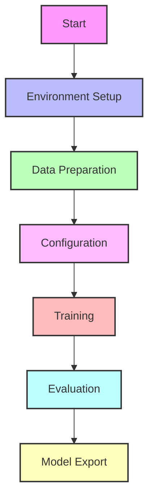

# WronAI Training Documentation Index

This document serves as a central hub for all WronAI training-related documentation. Use this index to navigate to specific aspects of the training process.

## Core Training Documentation

| Document | Description |
|----------|-------------|
| [Training Guide](training.md) | Comprehensive guide to training the WronAI model with step-by-step instructions |
| [Pipeline Documentation](pipeline.md) | Technical overview of the training pipeline with code references |
| [Model Architecture](model_architecture.md) | Detailed explanation of the WronAI model architecture and adaptations |

## Training Process



## Key Files and Components

### Configuration Files

- [`configs/default.yaml`](../configs/default.yaml): Default training configuration
- [`configs/quick_test.yaml`](../configs/quick_test.yaml): Configuration for quick testing (if available)

### Training Scripts

- [`scripts/train.py`](../scripts/train.py): Main training script
- [`scripts/prepare_data.py`](../scripts/prepare_data.py): Data preparation script

### Model Components

- Base model: Mistral-7B
- Adaptation: QLoRA fine-tuning
- Optimization: 4-bit quantization

## Training Parameters Quick Reference

| Parameter | Default Value | Description |
|-----------|---------------|-------------|
| Base Model | mistralai/Mistral-7B-v0.1 | Foundation model |
| LoRA Rank | 16 | Rank of LoRA update matrices |
| LoRA Alpha | 32 | LoRA scaling factor |
| Quantization | 4-bit NF4 | Memory-efficient quantization |
| Batch Size | 1 | Per device batch size |
| Gradient Accumulation | 16 | Steps for gradient accumulation |
| Learning Rate | 2e-4 | Training learning rate |
| Epochs | 3 | Number of training epochs |

## Training Command Quick Reference

```bash
# Standard training
python scripts/train.py --config configs/default.yaml

# Using Makefile
make train

# With custom configuration
python scripts/train.py --config configs/custom.yaml
```

## Related Documentation

- [Installation Guide](installation.md): Setting up the environment
- [Inference Guide](inference.md): Using the trained model
- [Benchmarks](benchmarks.md): Model evaluation
- [Troubleshooting](troubleshooting.md): Common issues and solutions

## Tutorials

- [Basic Usage](tutorials/01_basic_usage.md): Getting started with WronAI
- [Custom Training](tutorials/02_custom_training.md): Customizing the training process
- [Deployment](tutorials/03_deployment.md): Deploying the model
- [Advanced Features](tutorials/04_advanced_features.md): Advanced WronAI features
