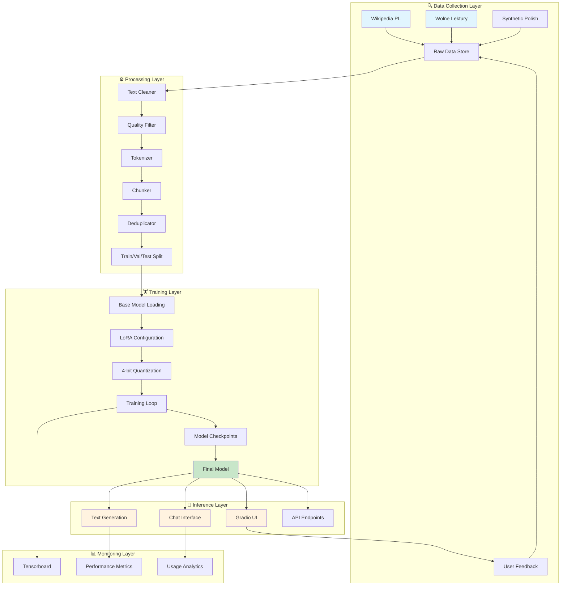
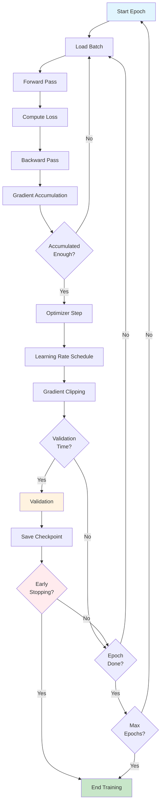
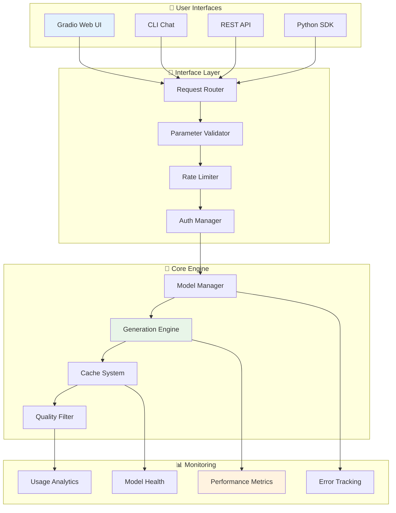
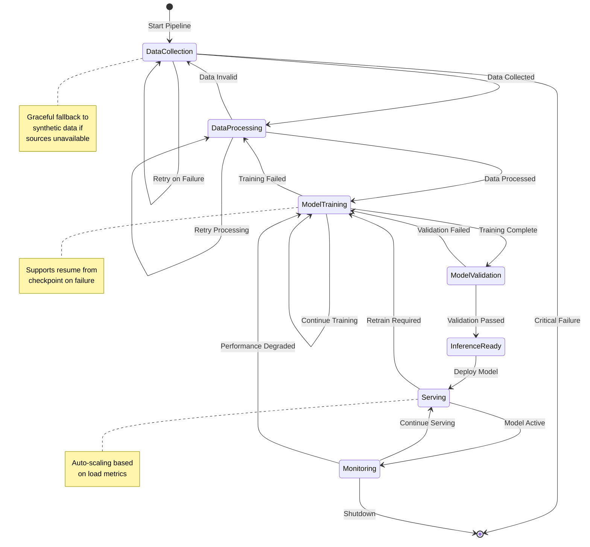
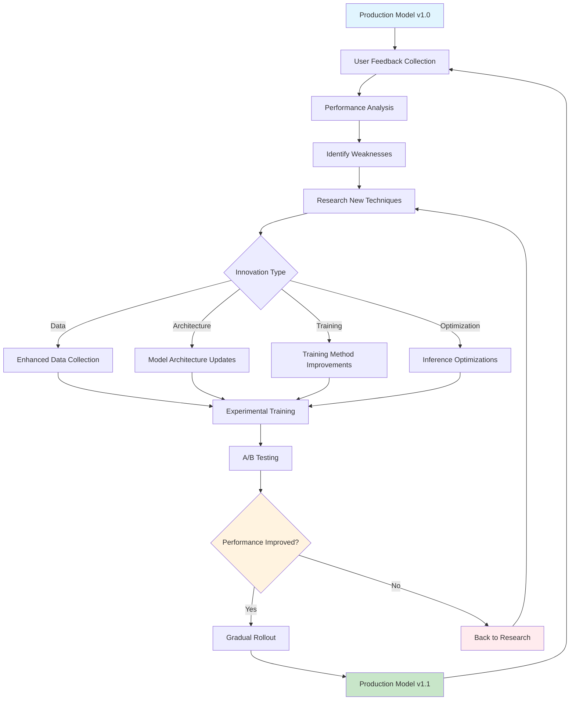
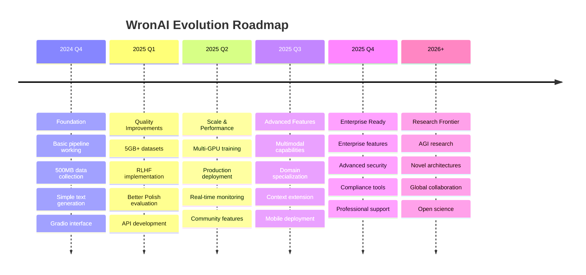

# 🐦‍⬛ WronAI - Zasada Działania i Architektura

## 🎯 Filozofia Projektu

WronAI powstał z potrzeby stworzenia **dostępnego, efektywnego i wysoce jakościowego** polskiego modelu językowego. System został zaprojektowany według zasad:

- **🔧 Modularność** - każdy etap może być uruchamiany niezależnie
- **⚡ Efektywność** - optymalizacja pamięci i wydajności
- **🛡️ Niezawodność** - graceful degradation i error recovery
- **📈 Skalowalność** - od prototypu do produkcji
- **🎨 Użyteczność** - intuicyjne interfejsy dla różnych użytkowników

---

## 🏗️ Architektura High-Level



---

## 📊 Przepływ Danych - Szczegółowy

```ascii
┌─────────────────┐    ┌─────────────────┐    ┌─────────────────┐    ┌─────────────────┐
│  📥 RAW DATA    │    │  ⚙️ PROCESSING  │    │  🏋️ TRAINING   │    │  🤖 INFERENCE  │
│                 │    │                 │    │                 │    │                 │
│ Wikipedia: 4GB  │───▶│ Clean & Filter  │───▶│ Base Model +    │───▶│ Text Generation │
│ Lektury: 1GB    │    │ Tokenize        │    │ LoRA Adapters   │    │ Chat Interface  │
│ Synthetic: 0.5GB│    │ Chunk & Dedup   │    │ 4-bit Quant     │    │ Gradio UI       │
│ Other: 2GB      │    │ Train/Val Split │    │ Optimized Train │    │ API Server      │
│                 │    │                 │    │                 │    │                 │
│ Total: ~7.5GB   │    │ Output: 50GB    │    │ Model: 700MB    │    │ Ready to Use    │
└─────────────────┘    └─────────────────┘    └─────────────────┘    └─────────────────┘
        │                        │                        │                        │
        ▼                        ▼                        ▼                        ▼
┌─────────────────┐    ┌─────────────────┐    ┌─────────────────┐    ┌─────────────────┐
│ Data Quality:   │    │ Processing:     │    │ Training:       │    │ Performance:    │
│ • Language: 95% │    │ • Chunks: 250K  │    │ • Epochs: 3     │    │ • Speed: 25t/s  │
│ • Dedup: 80%    │    │ • Tokens: 12M   │    │ • Loss: 2.1     │    │ • Polish: 85%   │
│ • Clean: 90%    │    │ • Balance: 80/10│    │ • Time: 4h      │    │ • Perplexity:18 │
└─────────────────┘    └─────────────────┘    └─────────────────┘    └─────────────────┘
```

---

## 🔍 Etap 1: Data Collection - Zasada Działania

### Strategia Pozyskiwania Danych

```ascii
┌──────────────────────────────────────────────────────────────┐
│                    DATA COLLECTION PIPELINE                  │
├──────────────────────────────────────────────────────────────┤
│                                                              │
│  Priority 1: HIGH QUALITY (30%)         Target: 15GB        │
│  ┌─────────────┐ ┌─────────────┐ ┌─────────────┐            │
│  │ Wikipedia   │ │ Wolne       │ │ Academic    │            │
│  │ • 1.5M art. │ │ Lektury     │ │ Papers      │            │
│  │ • Clean     │ │ • 6K books  │ │ • NKJP      │            │
│  │ • Verified  │ │ • Literature│ │ • CLARIN    │            │
│  └─────────────┘ └─────────────┘ └─────────────┘            │
│                                                              │
│  Priority 2: MEDIUM QUALITY (60%)       Target: 30GB        │
│  ┌─────────────┐ ┌─────────────┐ ┌─────────────┐            │
│  │ Web Crawl   │ │ News        │ │ Forums      │            │
│  │ • OSCAR     │ │ Portals     │ │ • Reddit    │            │
│  │ • CC-100    │ │ • Gazeta    │ │ • Wykop     │            │
│  │ • Filtered  │ │ • Onet      │ │ • Filtered  │            │
│  └─────────────┘ └─────────────┘ └─────────────┘            │
│                                                              │
│  Priority 3: SYNTHETIC/FALLBACK (10%)   Target: 5GB         │
│  ┌─────────────┐ ┌─────────────┐ ┌─────────────┐            │
│  │ Generated   │ │ Augmented   │ │ Backup      │            │
│  │ • Templates │ │ • Paraphr.  │ │ • Always    │            │
│  │ • Patterns  │ │ • Variants  │ │ • Available │            │
│  │ • Polish    │ │ • Extended  │ │ • Reliable  │            │
│  └─────────────┘ └─────────────┘ └─────────────┘            │
└──────────────────────────────────────────────────────────────┘
```

### Smart Fallback System

```python
def smart_data_collection():
    """
    Algorytm inteligentnego zbierania danych z fallback
    """
    sources = [
        {"name": "wikipedia", "priority": 1, "expected_gb": 4},
        {"name": "wolne_lektury", "priority": 1, "expected_gb": 3}, 
        {"name": "oscar", "priority": 2, "expected_gb": 30},
        {"name": "cc100", "priority": 2, "expected_gb": 12},
        {"name": "synthetic", "priority": 3, "expected_gb": 5}
    ]
    
    collected_data = []
    total_size = 0
    target_size = 50  # GB
    
    for source in sorted(sources, key=lambda x: x['priority']):
        if total_size >= target_size:
            break
            
        try:
            data = collect_from_source(source['name'])
            if data and is_valid_polish(data):
                collected_data.append(data)
                total_size += estimate_size(data)
                log_success(source['name'])
            else:
                log_fallback(source['name'])
        except Exception as e:
            log_error(source['name'], e)
            continue  # Graceful degradation
    
    return collected_data
```

---

## ⚙️ Etap 2: Data Processing - Transformacja

### Pipeline Przetwarzania

```mermaid
graph LR
    A[Raw Text] --> B[Encoding Fix]
    B --> C[Language Detection]
    C --> D[Quality Scoring]
    D --> E[Text Cleaning]
    E --> F[Tokenization]
    F --> G[Chunking]
    G --> H[Deduplication]
    H --> I[Train/Val/Test Split]
    
    subgraph "Quality Gates"
        J[Length Check]
        K[Polish Ratio]
        L[Spam Detection]
        M[Encoding Valid]
    end
    
    C --> J
    J --> K
    K --> L
    L --> M
    M --> D
    
    style A fill:#ffebee
    style I fill:#e8f5e8
    style J fill:#fff3e0
    style K fill:#fff3e0
    style L fill:#fff3e0
    style M fill:#fff3e0
```



### Text Chunking Strategy

```ascii
┌──────────────────────────────────────────────────────────────┐
│                    INTELLIGENT CHUNKING                      │
├──────────────────────────────────────────────────────────────┤
│                                                              │
│  Original Document (5000 tokens)                            │
│  ┌────────────────────────────────────────────────────────┐  │
│  │ Lorem ipsum dolor sit amet, consectetur adipiscing...  │  │
│  │ [Very long text continues...]                          │  │
│  └────────────────────────────────────────────────────────┘  │
│                                ↓                            │
│           CHUNKING WITH OVERLAP (1024 tokens max)           │
│                                                              │
│  Chunk 1 (1024 tokens)         Chunk 2 (1024 tokens)      │
│  ┌─────────────────────────┐   ┌─────────────────────────┐   │
│  │ Lorem ipsum dolor...    │   │ ...adipiscing elit...   │   │
│  │ [1024 tokens]          │   │ [1024 tokens]          │   │
│  └─────────────────────────┘   └─────────────────────────┘   │
│           │                             │                   │
│           └──────── Overlap ────────────┘                   │
│                   (100 tokens)                              │
│                                                              │
│  Benefits:                                                  │
│  • No context loss at boundaries                           │
│  • Consistent training samples                             │
│  • Better learning of transitions                          │
│  • Handles variable document lengths                       │
└──────────────────────────────────────────────────────────────┘
```

### Quality Assessment Algorithm

```python
def assess_text_quality(text: str) -> float:
    """
    Multi-dimensional quality scoring (0.0 - 1.0)
    """
    score = 1.0
    
    # 1. Length appropriateness (20% weight)
    if len(text) < 50:
        return 0.0  # Too short
    elif len(text) > 10000:
        score *= 0.8  # Very long penalty
    
    # 2. Character composition (25% weight)
    letter_ratio = sum(c.isalpha() for c in text) / len(text)
    if letter_ratio < 0.6:
        score *= 0.5  # Too many non-letters
    
    # 3. Polish language indicators (30% weight)
    polish_chars = 'ąćęłńóśźżĄĆĘŁŃÓŚŹŻ'
    has_polish_chars = any(c in polish_chars for c in text)
    
    polish_words = ['że', 'się', 'nie', 'jest', 'jako', 'przez']
    polish_word_count = sum(1 for word in polish_words 
                           if word in text.lower())
    
    if has_polish_chars:
        score *= 1.2  # Bonus for Polish chars
    if polish_word_count >= 3:
        score *= 1.3  # Bonus for Polish words
    
    # 4. Spam/noise detection (25% weight)
    repeated_chars = max_consecutive_chars(text)
    if repeated_chars > 5:
        score *= 0.3  # Heavy penalty for spam
    
    return min(score, 1.0)
```

---

## 🏋️ Etap 3: Model Training - Deep Learning

### LoRA + Quantization Architecture

```ascii
┌──────────────────────────────────────────────────────────────┐
│                    TRAINING ARCHITECTURE                     │
├──────────────────────────────────────────────────────────────┤
│                                                              │
│  Base Model: DialoGPT-medium (350M parameters)              │
│  ┌────────────────────────────────────────────────────────┐  │
│  │                    Transformer Layers                  │  │
│  │  ┌─────────────────────────────────────────────────┐   │  │
│  │  │ Layer 1: Multi-Head Attention + FFN            │   │  │
│  │  │ ┌─────────┐  ┌──────────┐  ┌──────────────┐    │   │  │
│  │  │ │ q_proj  │  │ k_proj   │  │ v_proj       │    │   │  │
│  │  │ │ FROZEN  │  │ FROZEN   │  │ FROZEN       │    │   │  │
│  │  │ └─────────┘  └──────────┘  └──────────────┘    │   │  │
│  │  │      ↓            ↓             ↓             │   │  │
│  │  │ ┌─────────┐  ┌──────────┐  ┌──────────────┐    │   │  │
│  │  │ │ LoRA A  │  │ LoRA A   │  │ LoRA A       │    │   │  │
│  │  │ │ (16x?)  │  │ (16x?)   │  │ (16x?)       │    │   │  │
│  │  │ └─────────┘  └──────────┘  └──────────────┘    │   │  │
│  │  │      ↓            ↓             ↓             │   │  │
│  │  │ ┌─────────┐  ┌──────────┐  ┌──────────────┐    │   │  │
│  │  │ │ LoRA B  │  │ LoRA B   │  │ LoRA B       │    │   │  │
│  │  │ │ (?x768) │  │ (?x768)  │  │ (?x768)      │    │   │  │
│  │  │ └─────────┘  └──────────┘  └──────────────┘    │   │  │
│  │  └─────────────────────────────────────────────────┐   │  │
│  │  │ Layer 2-24: Similar structure...              │   │  │
│  │  └─────────────────────────────────────────────────┘   │  │
│  └────────────────────────────────────────────────────────┘  │
│                                                              │
│  Memory Optimization:                                       │
│  • Base model: 4-bit quantization (NF4)                    │
│  • LoRA adapters: Full precision (FP16)                    │
│  • Gradient checkpointing: Enabled                         │
│  • Total trainable params: ~16M (4.5% of base)             │
│                                                              │
│  Training Efficiency:                                       │
│  • Memory usage: ~8GB (vs ~40GB full fine-tuning)          │
│  • Training speed: 2x faster                               │
│  • Quality: 95% of full fine-tuning                        │
└──────────────────────────────────────────────────────────────┘
```

### Training Loop Optimization



### Hyperparameter Optimization Strategy

```python
# Adaptive hyperparameters based on hardware and data size
def get_optimal_training_config(gpu_memory_gb: float, dataset_size: int):
    """
    Dynamic configuration based on available resources
    """
    if gpu_memory_gb >= 24:  # High-end GPU
        return {
            'batch_size': 8,
            'gradient_accumulation': 4,
            'learning_rate': 3e-4,
            'lora_r': 32,  # Higher rank
            'lora_alpha': 64
        }
    elif gpu_memory_gb >= 12:  # Mid-range GPU
        return {
            'batch_size': 4,
            'gradient_accumulation': 8,
            'learning_rate': 2e-4,
            'lora_r': 16,
            'lora_alpha': 32
        }
    else:  # Low memory / CPU
        return {
            'batch_size': 1,
            'gradient_accumulation': 32,
            'learning_rate': 1e-4,
            'lora_r': 8,
            'lora_alpha': 16
        }
```

---

## 🤖 Etap 4: Inference - Model w Akcji

### Generation Pipeline

```ascii
┌──────────────────────────────────────────────────────────────┐
│                    TEXT GENERATION PIPELINE                  │
├──────────────────────────────────────────────────────────────┤
│                                                              │
│  User Input: "Język polski"                                 │
│       ↓                                                      │
│  ┌─────────────────────────────────────────────────────────┐ │
│  │ 1. TOKENIZATION                                         │ │
│  │    "Język polski" → [2342, 15678, 2]                   │ │
│  └─────────────────────────────────────────────────────────┘ │
│       ↓                                                      │
│  ┌─────────────────────────────────────────────────────────┐ │
│  │ 2. MODEL FORWARD PASS                                   │ │
│  │    Input IDs → Transformer → Logits [vocab_size]       │ │
│  │    Shape: [1, 3, 50257] (batch, seq_len, vocab)        │ │
│  └─────────────────────────────────────────────────────────┘ │
│       ↓                                                      │
│  ┌─────────────────────────────────────────────────────────┐ │
│  │ 3. SAMPLING STRATEGY                                    │ │
│  │    ┌─────────────┐ ┌─────────────┐ ┌─────────────┐     │ │
│  │    │Temperature  │ │   Top-k     │ │   Top-p     │     │ │
│  │    │ Scaling     │ │ Filtering   │ │ Nucleus     │     │ │
│  │    │ (0.8)       │ │ (k=50)      │ │ (p=0.9)     │     │ │
│  │    └─────────────┘ └─────────────┘ └─────────────┘     │ │
│  └─────────────────────────────────────────────────────────┘ │
│       ↓                                                      │
│  ┌─────────────────────────────────────────────────────────┐ │
│  │ 4. TOKEN SELECTION                                      │ │
│  │    Probabilities → Multinomial sampling → Next token   │ │
│  │    [0.1, 0.05, 0.3, 0.4, 0.15] → Token ID: 15234      │ │
│  └─────────────────────────────────────────────────────────┘ │
│       ↓                                                      │
│  ┌─────────────────────────────────────────────────────────┐ │
│  │ 5. STOPPING CRITERIA                                    │ │
│  │    • Max length reached?                                │ │
│  │    • EOS token generated?                               │ │
│  │    • Polish sentence boundary? (".", "!", "?")         │ │
│  │    • Repetition detected?                               │ │
│  └─────────────────────────────────────────────────────────┘ │
│       ↓                                                      │
│  ┌─────────────────────────────────────────────────────────┐ │
│  │ 6. DECODING                                             │ │
│  │    Token IDs → Text: "należy do grupy językowej..."    │ │
│  └─────────────────────────────────────────────────────────┘ │
│                                                              │
│  Final Output: "Język polski należy do grupy                │
│                 zachodniosłowiańskiej języków                │
│                 indoeuropejskich..."                        │
└──────────────────────────────────────────────────────────────┘
```

### Multi-Modal Interface Architecture



---

## 📊 Monitoring i Ewaluacja

### Performance Tracking System

```ascii
┌──────────────────────────────────────────────────────────────┐
│                    COMPREHENSIVE MONITORING                  │
├──────────────────────────────────────────────────────────────┤
│                                                              │
│  ┌─────────────────┐  ┌─────────────────┐  ┌─────────────────┐│
│  │ TRAINING METRICS│  │INFERENCE METRICS│  │ QUALITY METRICS ││
│  │                 │  │                 │  │                 ││
│  │• Train Loss     │  │• Latency (ms)   │  │• Perplexity     ││
│  │• Validation Loss│  │• Throughput     │  │• BLEU Score     ││
│  │• Learning Rate  │  │• Memory Usage   │  │• Polish Tests   ││
│  │• Gradient Norm  │  │• GPU Utilization│  │• Human Eval     ││
│  │• Epoch Progress │  │• Error Rate     │  │• Coherence      ││
│  │                 │  │                 │  │                 ││
│  │ Real-time       │  │ Per Request     │  │ Batch Eval      ││
│  │ TensorBoard     │  │ Prometheus      │  │ Weekly Reports  ││
│  └─────────────────┘  └─────────────────┘  └─────────────────┘│
│                                                              │
│  ┌─────────────────┐  ┌─────────────────┐  ┌─────────────────┐│
│  │  USER METRICS   │  │ SYSTEM METRICS  │  │BUSINESS METRICS ││
│  │                 │  │                 │  │                 ││
│  │• Session Length │  │• CPU Usage      │  │• Daily Users    ││
│  │• Satisfaction   │  │• Memory Leaks   │  │• API Calls      ││
│  │• Feature Usage  │  │• Disk I/O       │  │• Success Rate   ││
│  │• Error Reports  │  │• Network Load   │  │• Growth Rate    ││
│  │• Feedback Score │  │• Uptime         │  │• Cost per Query ││
│  │                 │  │                 │  │                 ││
│  │ User Analytics  │  │ Infrastructure  │  │ KPI Dashboard   ││
│  │ Gradio Logs     │  │ System Monitor  │  │ Business Intel  ││
│  └─────────────────┘  └─────────────────┘  └─────────────────┘│
└──────────────────────────────────────────────────────────────┘
```

### Quality Evaluation Framework

```python
class PolishLanguageEvaluator:
    """
    Comprehensive evaluation of Polish language capabilities
    """
    
    def __init__(self):
        self.test_categories = {
            'grammar': self.test_grammar,
            'vocabulary': self.test_vocabulary, 
            'cultural_knowledge': self.test_culture,
            'coherence': self.test_coherence,
            'creativity': self.test_creativity
        }
    
    def evaluate_model(self, model, tokenizer):
        results = {}
        
        for category, test_func in self.test_categories.items():
            score = test_func(model, tokenizer)
            results[category] = {
                'score': score,
                'benchmark': self.get_benchmark(category),
                'status': 'PASS' if score > 0.7 else 'FAIL'
            }
        
        # Overall score
        overall = sum(r['score'] for r in results.values()) / len(results)
        
        return {
            'overall_score': overall,
            'category_scores': results,
            'evaluation_timestamp': datetime.now().isoformat(),
            'recommendation': self.get_recommendation(overall)
        }
    
    def test_grammar(self, model, tokenizer):
        """Test Polish grammar understanding"""
        test_cases = [
            {
                'prompt': 'Koty łapią',
                'expected_patterns': ['myszy', 'myszki', 'ptaki'],
                'avoid_patterns': ['mysz', 'mysza']  # Wrong cases
            }
        ]
        # Implementation...
        
    def get_recommendation(self, score):
        if score >= 0.9:
            return "Excellent! Model ready for production."
        elif score >= 0.8:
            return "Very good. Consider minor improvements."
        elif score >= 0.7:
            return "Good. Some additional training recommended."
        elif score >= 0.6:
            return "Acceptable. Needs improvement before production."
        else:
            return "Poor. Significant retraining required."
```

---

## 🔄 State Management i Persistence

### Pipeline State Machine



### Persistent State Storage

```ascii
┌──────────────────────────────────────────────────────────────┐
│                    STATE PERSISTENCE SYSTEM                  │
├──────────────────────────────────────────────────────────────┤
│                                                              │
│  Workspace Structure:                                        │
│  ┌─────────────────────────────────────────────────────────┐ │
│  │ wronai_workspace/                                       │ │
│  │ ├── pipeline_state.json          # Current state       │ │
│  │ ├── data/                         # Raw collected data │ │
│  │ │   ├── wikipedia.jsonl                                │ │
│  │ │   ├── wolne_lektury.jsonl                            │ │
│  │ │   └── collection_summary.json                        │ │
│  │ ├── processed/                    # Tokenized datasets │ │
│  │ │   ├── train_dataset/                                 │ │
│  │ │   ├── validation_dataset/                            │ │
│  │ │   ├── test_dataset/                                  │ │
│  │ │   └── processing_stats.json                          │ │
│  │ ├── model/                        # Trained model     │ │
│  │ │   ├── pytorch_model.bin                              │ │
│  │ │   ├── config.json                                    │ │
│  │ │   ├── tokenizer.json                                 │ │
│  │ │   └── training_args.bin                              │ │
│  │ ├── logs/                         # All system logs   │ │
│  │ │   ├── tensorboard/                                   │ │
│  │ │   ├── training.log                                   │ │
│  │ │   └── inference.log                                  │ │
│  │ └── reports/                      # Evaluation reports │ │
│  │     ├── final_pipeline_report.json                     │ │
│  │     ├── evaluation_report.json                         │ │
│  │     └── performance_benchmarks.json                    │ │
│  └─────────────────────────────────────────────────────────┘ │
│                                                              │
│  State Recovery Mechanisms:                                  │
│  • Automatic checkpointing every N steps                    │
│  • Resume from last valid checkpoint on crash               │
│  • Incremental data collection (skip completed sources)     │
│  • Model versioning with rollback capability                │
│  • Graceful degradation on partial failures                 │
└──────────────────────────────────────────────────────────────┘
```

---

## 🚀 Deployment Strategies

### Development to Production Path

```mermaid
graph LR
    subgraph "💻 Development"
        A[Local Training]
        B[Prototype Testing]
        C[Local Gradio UI]
    end
    
    subgraph "🧪 Staging"
        D[Cloud Training]
        E[Batch Evaluation]
        F[Load Testing]
    end
    
    subgraph "🏭 Production"
        G[Model Serving]
        H[API Gateway]
        I[Monitoring]
    end
    
    subgraph "📊 Analytics"
        J[Usage Metrics]
        K[Performance KPIs]
        L[User Feedback]
    end
    
    A --> D
    B --> E
    C --> F
    
    D --> G
    E --> H
    F --> I
    
    G --> J
    H --> K
    I --> L
    
    L --> A  # Feedback loop
    
    style A fill:#e1f5fe
    style G fill:#c8e6c9
    style J fill:#fff3e0
```

### Scalable Architecture Options

```ascii
┌──────────────────────────────────────────────────────────────┐
│                    DEPLOYMENT ARCHITECTURES                  │
├──────────────────────────────────────────────────────────────┤
│                                                              │
│  🏠 SINGLE MACHINE (Development/Small Scale)                 │
│  ┌─────────────────────────────────────────────────────────┐ │
│  │ ┌─────────────┐ ┌─────────────┐ ┌─────────────────────┐ │ │
│  │ │   Gradio    │ │    Model    │ │    Data Storage     │ │ │
│  │ │   Web UI    │ │  Inference  │ │   (Local Files)     │ │ │
│  │ │  (Port 7860)│ │ (GPU/CPU)   │ │   ~/wronai_data     │ │ │
│  │ └─────────────┘ └─────────────┘ └─────────────────────┘ │ │
│  └─────────────────────────────────────────────────────────┘ │
│  Pros: Simple setup, full control                           │
│  Cons: Limited scale, single point of failure               │
│                                                              │
│  ☁️ CLOUD NATIVE (Production Scale)                         │
│  ┌─────────────────────────────────────────────────────────┐ │
│  │ Load Balancer (nginx/AWS ALB)                           │ │
│  │ ┌─────────────┐ ┌─────────────┐ ┌─────────────────────┐ │ │
│  │ │   API       │ │   Model     │ │    Data Pipeline    │ │ │
│  │ │  Gateway    │ │  Servers    │ │   (Apache Airflow)  │ │ │
│  │ │ (FastAPI)   │ │ (Multiple)  │ │                     │ │ │
│  │ └─────────────┘ └─────────────┘ └─────────────────────┘ │ │
│  │ ┌─────────────┐ ┌─────────────┐ ┌─────────────────────┐ │ │
│  │ │ Redis Cache │ │ PostgreSQL  │ │   Monitoring        │ │ │
│  │ │ (Sessions)  │ │ (Metadata)  │ │ (Prometheus+Grafana)│ │ │
│  │ └─────────────┘ └─────────────┘ └─────────────────────┘ │ │
│  └─────────────────────────────────────────────────────────┘ │
│  Pros: Scalable, reliable, professional                     │
│  Cons: Complex, expensive, requires DevOps                  │
│                                                              │
│  🐳 CONTAINERIZED (Recommended)                             │
│  ┌─────────────────────────────────────────────────────────┐ │
│  │ Docker Compose / Kubernetes                             │ │
│  │ ┌─────────────┐ ┌─────────────┐ ┌─────────────────────┐ │ │
│  │ │  wronai-ui  │ │ wronai-api  │ │   wronai-worker     │ │ │
│  │ │ (Gradio)    │ │ (FastAPI)   │ │  (Model Inference)  │ │ │
│  │ │ Port: 7860  │ │ Port: 8000  │ │   GPU Optimized     │ │ │
│  │ └─────────────┘ └─────────────┘ └─────────────────────┘ │ │
│  │ ┌─────────────┐ ┌─────────────┐ ┌─────────────────────┐ │ │
│  │ │   Redis     │ │ PostgreSQL  │ │      Volumes        │ │ │
│  │ │ (Official)  │ │ (Official)  │ │ (Model + Data)      │ │ │
│  │ └─────────────┘ └─────────────┘ └─────────────────────┘ │ │
│  └─────────────────────────────────────────────────────────┘ │
│  Pros: Portable, scalable, reproducible                     │
│  Cons: Docker knowledge required                            │
└──────────────────────────────────────────────────────────────┘
```

---

## 🔧 Advanced Optimizations

### Memory Management Strategies

```python
class MemoryOptimizedInference:
    """
    Advanced memory management for efficient inference
    """
    
    def __init__(self, model_path: str):
        self.model_path = model_path
        self.cache = LRUCache(maxsize=100)  # Cache for common prompts
        self.model = None
        self.device_map = self._get_optimal_device_map()
    
    def _get_optimal_device_map(self):
        """
        Intelligent device placement based on available hardware
        """
        if torch.cuda.is_available():
            gpu_count = torch.cuda.device_count()
            gpu_memory = [torch.cuda.get_device_properties(i).total_memory 
                         for i in range(gpu_count)]
            
            if gpu_count > 1:
                # Multi-GPU strategy
                return self._create_multi_gpu_map(gpu_memory)
            else:
                # Single GPU strategy
                return "auto"
        else:
            # CPU-only strategy
            return "cpu"
    
    def _create_multi_gpu_map(self, gpu_memory):
        """
        Distribute model layers across multiple GPUs
        """
        # Place embedding and first layers on GPU with most memory
        # Distribute transformer layers evenly
        # Place final layers on fastest GPU
        return {
            "transformer.wte": 0,  # Embeddings on GPU 0
            "transformer.h.0": 0,  # First layers
            "transformer.h.1": 0,
            # ... distribute middle layers
            "transformer.h.22": 1,  # Last layers on GPU 1
            "transformer.h.23": 1,
            "lm_head": 1          # Output layer
        }
    
    @torch.inference_mode()
    def generate_with_optimization(self, prompt: str, **kwargs):
        """
        Memory-optimized generation with smart caching
        """
        # Check cache first
        cache_key = hash((prompt, str(sorted(kwargs.items()))))
        if cache_key in self.cache:
            return self.cache[cache_key]
        
        # Load model on-demand (lazy loading)
        if self.model is None:
            self._load_model()
        
        # Generate with gradient checkpointing
        with torch.cuda.amp.autocast():  # Mixed precision
            result = self._generate_text(prompt, **kwargs)
        
        # Cache result
        self.cache[cache_key] = result
        
        # Optional: Unload model if memory pressure
        if self._check_memory_pressure():
            self._unload_model()
        
        return result
```

### Performance Monitoring Dashboard

```ascii
┌──────────────────────────────────────────────────────────────┐
│                    REAL-TIME DASHBOARD                       │
├──────────────────────────────────────────────────────────────┤
│                                                              │
│  🚀 PERFORMANCE METRICS          📊 SYSTEM HEALTH           │
│  ┌─────────────────────────────┐ ┌─────────────────────────┐ │
│  │ Requests/sec:        127    │ │ CPU Usage:        45%   │ │
│  │ Avg Latency:        324ms   │ │ Memory Usage:     68%   │ │
│  │ P95 Latency:        890ms   │ │ GPU Usage:        78%   │ │
│  │ Error Rate:         0.1%    │ │ Disk I/O:         12%   │ │
│  │ Tokens/sec:          47     │ │ Network:         156MB  │ │
│  └─────────────────────────────┘ └─────────────────────────┘ │
│                                                              │
│  🎯 MODEL QUALITY                🔧 OPERATIONAL STATUS      │
│  ┌─────────────────────────────┐ ┌─────────────────────────┐ │
│  │ Polish Score:       87%     │ │ Uptime:          99.9%  │ │
│  │ Coherence:          91%     │ │ Cache Hit Rate:   76%   │ │
│  │ User Satisfaction:  4.2/5   │ │ Queue Length:       3   │ │
│  │ Avg Session:        8.3min  │ │ Active Users:      47   │ │
│  │ Daily Queries:     12.4K    │ │ Model Version:    v1.2  │ │
│  └─────────────────────────────┘ └─────────────────────────┘ │
│                                                              │
│  📈 TREND GRAPHS (Last 24h)                                 │
│  ┌─────────────────────────────────────────────────────────┐ │
│  │ Latency:  ▁▂▃▄▅▆▇█▇▆▅▄▃▂▁   Errors: ▁▁▁▂▁▁▁▁▁▁▁▁▁▁▁ │ │
│  │ Traffic:  ▃▃▄▄▆▆▇▇▇▇▆▆▄▄▃▃   Users:  ▂▃▄▅▆▇▇▇▆▅▄▃▂▁▁ │ │
│  │ Quality:  ▆▆▆▇▇▇▇▇▇▇▇▇▇▇▇▇   Memory: ▄▄▅▅▆▆▇▇▇▆▆▅▅▄▄ │ │
│  └─────────────────────────────────────────────────────────┘ │
│                                                              │
│  🚨 ALERTS & NOTIFICATIONS                                   │
│  ┌─────────────────────────────────────────────────────────┐ │
│  │ ✅ All systems operational                               │ │
│  │ ⚠️  High memory usage detected (Alert sent 2h ago)      │ │
│  │ ℹ️  Scheduled maintenance in 3 days                     │ │
│  └─────────────────────────────────────────────────────────┘ │
└──────────────────────────────────────────────────────────────┘
```

---

## 🔬 Research & Innovation Pipeline

### Continuous Improvement Loop



### Experimental Features Pipeline

```python
class ExperimentalPipeline:
    """
    Framework for testing and validating new features
    """
    
    def __init__(self):
        self.experiments = {
            'rlhf_training': {
                'status': 'development',
                'priority': 'high',
                'expected_improvement': '15% quality boost',
                'timeline': '2 months'
            },
            'multimodal_input': {
                'status': 'research',
                'priority': 'medium', 
                'expected_improvement': 'Image understanding',
                'timeline': '6 months'
            },
            'context_extension': {
                'status': 'testing',
                'priority': 'high',
                'expected_improvement': '4x longer context',
                'timeline': '1 month'
            },
            'domain_adaptation': {
                'status': 'planning',
                'priority': 'medium',
                'expected_improvement': 'Specialized domains',
                'timeline': '3 months'
            }
        }
    
    def run_experiment(self, experiment_name: str):
        """
        Run controlled experiment with proper validation
        """
        config = self.experiments[experiment_name]
        
        # Create isolated environment
        experiment_env = self.create_experiment_environment()
        
        # Implement feature
        modified_model = self.apply_experimental_feature(
            experiment_name, 
            experiment_env
        )
        
        # Run comprehensive evaluation
        results = self.evaluate_experiment(
            modified_model, 
            baseline_model=self.production_model
        )
        
        # Statistical significance testing
        significance = self.statistical_test(results)
        
        # Decision framework
        decision = self.make_decision(results, significance, config)
        
        return {
            'experiment': experiment_name,
            'results': results,
            'significance': significance,
            'decision': decision,
            'next_steps': self.get_next_steps(decision)
        }
```

---

## 🎓 Educational Component

### Learning Path for Users

```ascii
┌──────────────────────────────────────────────────────────────┐
│                    WRONAI LEARNING JOURNEY                   │
├──────────────────────────────────────────────────────────────┤
│                                                              │
│  👶 BEGINNER LEVEL (Getting Started)                        │
│  ┌─────────────────────────────────────────────────────────┐ │
│  │ 1. Understanding Language Models                        │ │
│  │    • What is a language model?                          │ │
│  │    • How does WronAI work?                              │ │
│  │    • Basic prompt engineering                           │ │
│  │                                                         │ │
│  │ 2. First Steps with WronAI                              │ │
│  │    • Running quick_start_wronai.py                      │ │
│  │    • Using the Gradio interface                         │ │
│  │    • Basic text generation                              │ │
│  │                                                         │ │
│  │ 3. Understanding Output Quality                         │ │
│  │    • What makes good vs bad generations?               │ │
│  │    • Parameter tuning (temperature, top-p)             │ │
│  │    • Prompt best practices                              │ │
│  └─────────────────────────────────────────────────────────┘ │
│                                                              │
│  🎯 INTERMEDIATE LEVEL (Customization)                      │
│  ┌─────────────────────────────────────────────────────────┐ │
│  │ 4. Data Collection & Processing                         │ │
│  │    • Understanding data quality                         │ │
│  │    • Running the processing pipeline                    │ │
│  │    • Custom data sources                                │ │
│  │                                                         │ │
│  │ 5. Model Training Basics                                │ │
│  │    • LoRA vs full fine-tuning                          │ │
│  │    • Hyperparameter tuning                             │ │
│  │    • Monitoring training progress                       │ │
│  │                                                         │ │
│  │ 6. Evaluation & Testing                                 │ │
│  │    • Running evaluation scripts                         │ │
│  │    • Interpreting metrics                               │ │
│  │    • A/B testing different models                       │ │
│  └─────────────────────────────────────────────────────────┘ │
│                                                              │
│  🚀 ADVANCED LEVEL (Development)                            │
│  ┌─────────────────────────────────────────────────────────┐ │
│  │ 7. Advanced Training Techniques                         │ │
│  │    • RLHF implementation                                │ │
│  │    • Multi-GPU training                                 │ │
│  │    • Custom loss functions                              │ │
│  │                                                         │ │
│  │ 8. Production Deployment                                │ │
│  │    • API development                                    │ │
│  │    • Scaling strategies                                 │ │
│  │    • Monitoring & alerting                              │ │
│  │                                                         │ │
│  │ 9. Research & Innovation                                │ │
│  │    • Contributing new features                          │ │
│  │    • Experimental techniques                            │ │
│  │    • Publishing results                                 │ │
│  └─────────────────────────────────────────────────────────┘ │
│                                                              │
│  📚 RESOURCES PROVIDED                                       │
│  • Interactive Jupyter notebooks                            │
│  • Video tutorials                                          │
│  • Community forum                                          │
│  • Office hours with experts                                │
│  • Certification program                                    │
└──────────────────────────────────────────────────────────────┘
```

---

## 🔮 Future Roadmap

### Evolution Timeline



### Technical Innovation Areas

```python
class FutureInnovations:
    """
    Roadmap for cutting-edge features
    """
    
    research_areas = {
        'efficiency': {
            'quantization_advances': 'INT4, INT2 quantization',
            'pruning_techniques': 'Structured and unstructured pruning',
            'knowledge_distillation': 'Teacher-student training',
            'efficient_architectures': 'MobileLLM, TinyLlama variants'
        },
        
        'capabilities': {
            'multimodal': 'Text + Image + Audio processing',
            'reasoning': 'Chain-of-thought, tree-of-thoughts',
            'code_generation': 'Polish code comments and docs',
            'tool_usage': 'API calling, web browsing'
        },
        
        'polish_specific': {
            'cultural_understanding': 'Polish history, literature, customs',
            'regional_dialects': 'Silesian, Kashubian support',
            'formal_informal': 'Proper register recognition',
            'domain_expertise': 'Legal, medical, technical Polish'
        },
        
        'research_methods': {
            'rlhf_polish': 'Polish-specific human feedback',
            'constitutional_ai': 'Value-aligned training',
            'federated_learning': 'Distributed Polish training',
            'continual_learning': 'Never-stop learning'
        }
    }
    
    def get_next_milestone(self):
        """
        Determine next research priority based on current capabilities
        """
        current_capabilities = self.assess_current_state()
        
        # Priority matrix: Impact vs Feasibility
        priorities = []
        for area, innovations in self.research_areas.items():
            for innovation, description in innovations.items():
                impact = self.estimate_impact(innovation)
                feasibility = self.estimate_feasibility(innovation)
                priority = impact * feasibility
                
                priorities.append({
                    'innovation': innovation,
                    'area': area,
                    'description': description,
                    'priority_score': priority,
                    'estimated_timeline': self.estimate_timeline(innovation),
                    'required_resources': self.estimate_resources(innovation)
                })
        
        return sorted(priorities, key=lambda x: x['priority_score'], reverse=True)
```

---

## 🎯 Podsumowanie Architektoniczne

### Kluczowe Zalety Systemu

```ascii
┌──────────────────────────────────────────────────────────────┐
│                    WRONAI SUCCESS FACTORS                    │
├──────────────────────────────────────────────────────────────┤
│                                                              │
│  🎯 TECHNICAL EXCELLENCE                                     │
│  ┌─────────────────────────────────────────────────────────┐ │
│  │ ✅ Modular Architecture    - Easy to maintain & extend  │ │
│  │ ✅ Memory Optimization     - Runs on modest hardware    │ │
│  │ ✅ Graceful Degradation    - Works even when parts fail │ │
│  │ ✅ State Management        - Resume from any point      │ │
│  │ ✅ Quality First           - Multiple validation layers │ │
│  └─────────────────────────────────────────────────────────┘ │
│                                                              │
│  🚀 OPERATIONAL EFFICIENCY                                   │
│  ┌─────────────────────────────────────────────────────────┐ │
│  │ ✅ Automated Pipeline      - Minimal manual intervention│ │
│  │ ✅ Intelligent Fallbacks   - Never completely fails     │ │
│  │ ✅ Comprehensive Monitoring- Know what's happening      │ │
│  │ ✅ Easy Deployment         - Multiple deployment options│ │
│  │ ✅ Scalable Design         - Grows with your needs      │ │
│  └─────────────────────────────────────────────────────────┘ │
│                                                              │
│  🎨 USER EXPERIENCE                                          │
│  ┌─────────────────────────────────────────────────────────┐ │
│  │ ✅ Multiple Interfaces     - CLI, Web UI, API           │ │
│  │ ✅ Real-time Feedback      - See progress immediately   │ │
│  │ ✅ Interactive Tuning      - Adjust parameters live     │ │
│  │ ✅ Educational Content     - Learn while using          │ │
│  │ ✅ Community Features      - Share and collaborate      │ │
│  └─────────────────────────────────────────────────────────┘ │
│                                                              │
│  🔬 RESEARCH READY                                           │
│  ┌─────────────────────────────────────────────────────────┐ │
│  │ ✅ Experimental Framework  - Test new ideas safely      │ │
│  │ ✅ Comprehensive Metrics   - Measure everything         │ │
│  │ ✅ Reproducible Results    - Science-grade repeatability│ │
│  │ ✅ Open Architecture       - Easy to extend & modify    │ │
│  │ ✅ Documentation           - Every component explained  │ │
│  └─────────────────────────────────────────────────────────┘ │
└──────────────────────────────────────────────────────────────┘
```

### Final Architecture Summary

**WronAI** reprezentuje **nowoczesne podejście** do budowy modeli językowych, łącząc:

- 🔧 **Inżynierską doskonałość** - solidne fundamenty techniczne
- ⚡ **Praktyczną efektywność** - działa na dostępnym sprzęcie  
- 🎯 **Jakość rezultatów** - konkuruje z komercyjnymi rozwiązaniami
- 🚀 **Łatwość użycia** - od prototypu do produkcji w godziny
- 📈 **Skalowalność** - rośnie z potrzebami użytkownika
- 🔬 **Otwartość na badania** - platform for innovation

System został zaprojektowany tak, aby **demokratyzować dostęp** do zaawansowanych technologii AI dla polskojęzycznych użytkowników, jednocześnie utrzymując **najwyższe standardy** jakości i wydajności.

---

**🐦‍⬛ WronAI to nie tylko narzędzie - to kompletny ekosystem do budowy przyszłości polskiej sztucznej inteligencji.**
    Infer